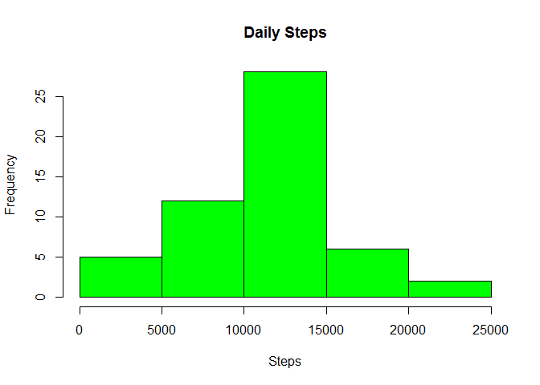
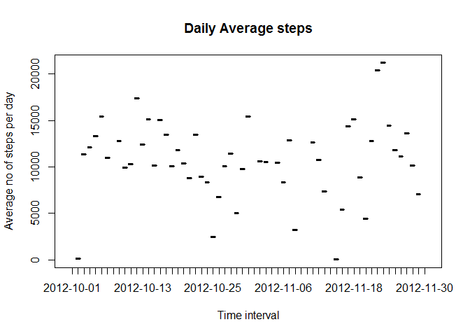
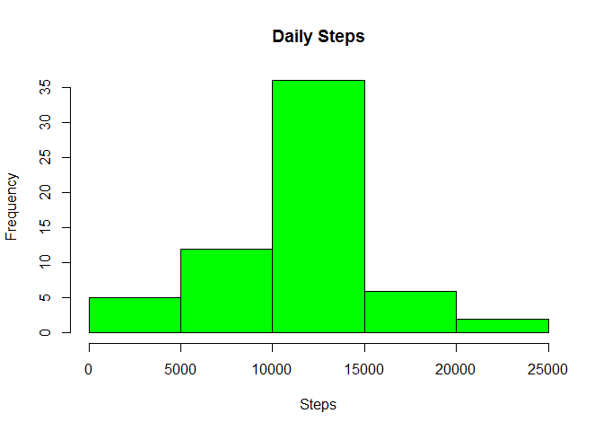
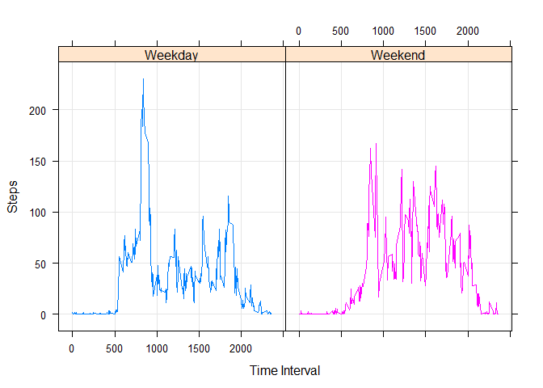

# Reproducible approach Project 1

## Reading the activity data file and loading in data frame

```r
setwd("C:/Users/aarora/Documents/Coursera/Reproducible_Code/Assignment 1")
activity<- read.csv("activity.csv")
head(activity)
```

```
##   steps       date interval
## 1    NA 2012-10-01        0
## 2    NA 2012-10-01        5
## 3    NA 2012-10-01       10
## 4    NA 2012-10-01       15
## 5    NA 2012-10-01       20
## 6    NA 2012-10-01       25
```

## Creating histogram for total daily steps

```r
data_agg<- aggregate(steps~date,activity,sum)
hist(data_agg$steps,col="green",xlab="Steps",main="Daily Steps")
```

<!-- -->

## Calculating mean and median of average number of steps taken

```r
Activity_mean<- mean(data_agg$steps)
Activity_median<- median(data_agg$steps)
```

The Mean number of steps per day is 1.0766189\times 10^{4}
The Median of total number of steps per day is 10765

## Time series plot of average number of steps taken

```r
head(activity)
```

```
##   steps       date interval
## 1    NA 2012-10-01        0
## 2    NA 2012-10-01        5
## 3    NA 2012-10-01       10
## 4    NA 2012-10-01       15
## 5    NA 2012-10-01       20
## 6    NA 2012-10-01       25
```

```r
data_avg<- aggregate(steps~interval,activity,mean)
plot(data_agg,ylab="Average no of steps per day",xlab="Time interval",main="Daily Average steps",type="l")
```

<!-- -->

## Interval for maximum number of steps

```r
max_steps<- max(data_avg$steps)
Interval<- grepl(max_steps,data_avg$steps)
max_interval<- data_avg[Interval,]
max_interval
```

```
##     interval    steps
## 104      835 206.1698
```
## Imputing missing values
Total number of missing values:

```r
sum(is.na(activity))
```

```
## [1] 2304
```

## Replacing missing values with mean of each time interval

```r
activity_new <- activity
na_values <- is.na(activity_new$steps)
interval <- tapply(activity_new$steps, activity_new$interval, mean, na.rm=TRUE, simplify = TRUE)
activity_new$steps[na_values] <- interval[as.character(activity_new$interval[na_values])]
head(activity_new)
```

```
##       steps       date interval
## 1 1.7169811 2012-10-01        0
## 2 0.3396226 2012-10-01        5
## 3 0.1320755 2012-10-01       10
## 4 0.1509434 2012-10-01       15
## 5 0.0754717 2012-10-01       20
## 6 2.0943396 2012-10-01       25
```

```r
sum(is.na(activity_new))
```

```
## [1] 0
```

## Histogram for Daily steps after missing values are filled

```r
data_agg_new<- aggregate(steps~date,activity_new,sum)
hist(data_agg_new$steps,col="green",xlab="Steps",main="Daily Steps")
```

<!-- -->

## Mean and median of new dataset with missing values imputed

```r
Activity_mean_NoNA<- mean(data_agg_new$steps,na.rm="TRUE")
Activity_median_NoNA<- median(data_agg_new$steps,na.rm="TRUE")
```

The New Mean for number of steps per day(missing values imputed) is 1.0766189\times 10^{4}
The New Median of total number of steps per day(missing values imputed) is 1.0766189\times 10^{4}

## Finding the pattern between weekdays and weekends

```r
activity_new$day<- weekdays(as.Date(activity_new$date))
activity_new$Week<- ifelse((activity_new$day=='Saturday'|activity_new$day=='Sunday'),'Weekend','Weekday')
data_agg_weekday<- aggregate(steps~interval+Week,activity_new,mean)
library(lattice)
xyplot(data_agg_weekday$steps~data_agg_weekday$interval|data_agg_weekday$Week,group=data_agg_weekday$Week,type='l',grid=TRUE,xlab="Time Interval",ylab="Steps")
```

<!-- -->

